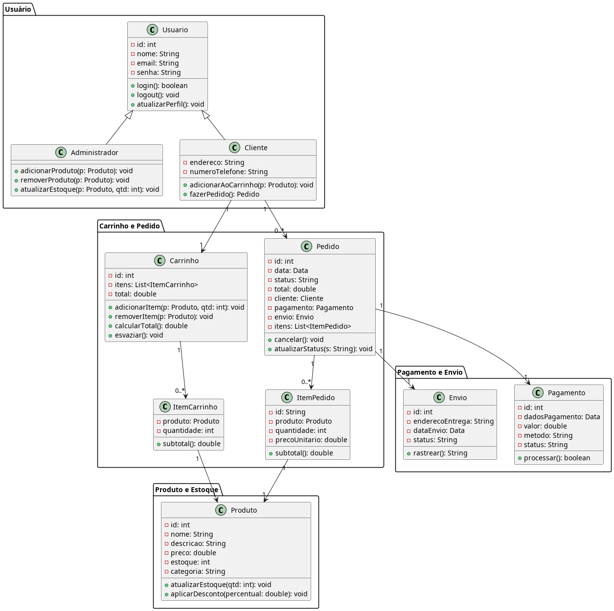

# E-commerce - Software para Persistência de Dados - Grupo 4

Este projeto é uma aplicação de e-commerce desenvolvida em Java utilizando o framework Spring Boot. O sistema foi modelado para abranger as principais funcionalidades de uma loja virtual, incluindo cadastro de usuários, gerenciamento de produtos, carrinho de compras, pedidos, pagamentos e envio.

## Sumário

- [Visão Geral](#visão-geral)
- [Principais Funcionalidades](#principais-funcionalidades)
- [Modelo de Domínio](#modelo-de-domínio)
- [Tecnologias Utilizadas](#tecnologias-utilizadas)
- [Como Executar](#como-executar)
- [Estrutura de Pacotes](#estrutura-de-pacotes)

---

## Visão Geral

A aplicação permite que clientes naveguem por produtos, adicionem itens ao carrinho, realizem pedidos, efetuem pagamentos e acompanhem o envio. Administradores podem gerenciar o catálogo de produtos e o estoque. O sistema foi projetado com base em boas práticas de orientação a objetos e segue uma arquitetura modular.

**Arquitetura:** O projeto segue o padrão MVC (Model-View-Controller), onde:
- **Models** representam as entidades de domínio.
- **Controllers** lidam com as requisições HTTP e direcionam o fluxo.
- **Services** concentram a lógica de negócio, promovendo separação de responsabilidades e facilitando a manutenção e testes.

---

## Principais Funcionalidades

- **Cadastro e autenticação de usuários (clientes e administradores)**
- **Gerenciamento de produtos e categorias**
- **Carrinho de compras**
- **Processamento de pedidos**
- **Pagamentos**
- **Rastreamento de envio**
- **Gestão de estoque**

---

## Modelo de Domínio

O sistema é composto pelos seguintes principais componentes:

### Usuário

- **Usuario**: Classe base para todos os usuários, contendo informações comuns como nome, email, senha e endereço.
- **Cliente**: Herda de Usuario, possui telefone e funcionalidades como adicionar ao carrinho e fazer pedidos.
- **Administrador**: Herda de Usuario, pode adicionar/remover produtos e atualizar o estoque.

### Produto e Estoque

- **Produto**: Representa um item à venda, com atributos como nome, descrição, preço, estoque e categoria.
- **Categoria**: Agrupa produtos similares.

### Carrinho e Pedido

- **Carrinho**: Armazena itens selecionados pelo cliente antes da finalização da compra.
- **ItemCarrinho**: Representa um produto e sua quantidade no carrinho.
- **Pedido**: Registra uma compra realizada, associando cliente, pagamento e envio.

### Pagamento e Envio

- **Pagamento**: Detalha o método, valor e status do pagamento de um pedido.
- **Envio**: Gerencia o endereço de entrega, data e status do envio.

### Endereço

- **Endereco**: Utilizado tanto por usuários quanto para o envio dos pedidos.

---

## Tecnologias Utilizadas

- **Java 21+**
- **Spring Boot**
- **Spring Data JPA**
- **PostgreSQL** (banco de dados principal)
- **Gradle**
- **Docker** (utilizado para containerizar a aplicação e o banco de dados)
- **JUnit (para testes)**

---

## Como Executar

1. **Clone o repositório:**
   ```bash
   git clone <url-do-repositorio>
   cd ecommerce
   ```

2. **Configure as variáveis de ambiente:**
   - Copie o arquivo de exemplo:
     ```bash
     cp .example.env .env
     ```
   - Edite o arquivo `.env` e ajuste os valores das variáveis conforme seu ambiente (usuário, senha e nome do banco de dados).

3. **Se necessário, ajuste também o arquivo `src/main/resources/application.properties` para garantir que as propriedades estejam configuradas para ler as variáveis de ambiente.**

4. **Execute a aplicação e o banco de dados via Docker Compose:**
   ```bash
   docker-compose up --build
   ```
   Isso irá subir tanto o banco de dados PostgreSQL quanto a aplicação Spring Boot em containers separados.

5. **Acesse:**  
   `http://localhost:8080`

---

## Estrutura de Pacotes

- `controllers/` - Controladores REST e web (camada Controller do MVC).
- `models/` - Entidades do domínio (camada Model do MVC).
- `services/` - Lógica de negócio (camada Service, intermediando Controllers e Models).
- `repositories/` - Interfaces de acesso a dados.

---

## Diagrama de Classes

O diagrama abaixo ilustra a estrutura das principais classes do sistema:




