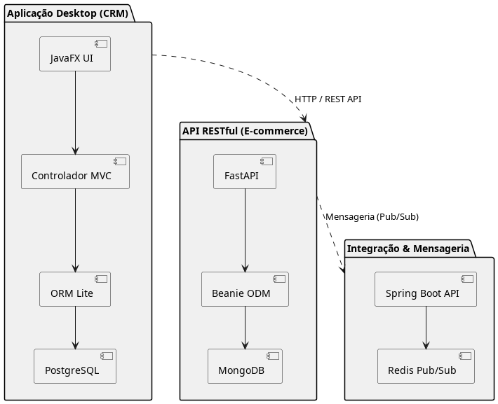
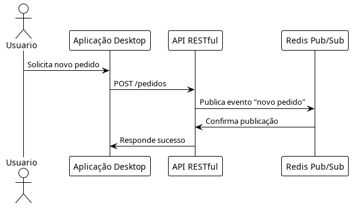

# E-commerce - Software para Persistência de Dados - Grupo 4

Este projeto é uma aplicação de e-commerce desenvolvida em Java utilizando o framework Spring Boot. O sistema foi modelado para abranger as principais funcionalidades de uma loja virtual, incluindo cadastro de usuários, gerenciamento de produtos, carrinho de compras, pedidos, pagamentos e envio.

## Sumário

- [Introdução](#introdução)
- [Visão Geral](#visão-geral)
- [Principais Funcionalidades](#principais-funcionalidades)
- [Modelo de Domínio](#modelo-de-domínio)
- [Tecnologias Utilizadas](#tecnologias-utilizadas)
- [Como Executar](#como-executar)
- [Estrutura de Pacotes](#estrutura-de-pacotes)
- [Diagramas](#diagramas)
- [Plano de Testes](#plano-de-testes)

---

## Introdução

O presente projeto tem como objetivo o desenvolvimento de um sistema de e-commerce acadêmico, integrando diferentes tecnologias e abordagens modernas de desenvolvimento de software. A proposta surge da necessidade de criar uma solução robusta, escalável e didaticamente relevante, que permita a aplicação prática de conceitos como arquitetura em camadas, integração de sistemas, persistência de dados relacional e não relacional, além de mensageria para integração entre componentes.

A motivação para este projeto está fundamentada na crescente demanda por sistemas de comércio eletrônico eficientes, seguros e integrados, capazes de atender tanto pequenas quanto grandes operações. Além disso, o projeto visa proporcionar aos integrantes do grupo a oportunidade de aprofundar conhecimentos em frameworks amplamente utilizados no mercado, como JavaFX, Spring Boot, ORMLite, MongoDB, Redis e Lettuce, promovendo o domínio de ferramentas essenciais para o desenvolvimento de aplicações modernas.

O problema a ser solucionado envolve a criação de uma plataforma que permita o cadastro, consulta, atualização e remoção de produtos, clientes e pedidos, além de possibilitar a integração entre diferentes módulos do sistema por meio de APIs RESTful e mecanismos de mensageria. O sistema deverá ser capaz de armazenar dados em bancos relacionais e não relacionais, além de garantir a comunicação eficiente entre seus componentes.

Este projeto, portanto, não apenas atende a uma demanda acadêmica, mas também simula desafios reais enfrentados por equipes de desenvolvimento de software, promovendo a colaboração, a divisão de tarefas e a aplicação de boas práticas de engenharia de software.

---

## Visão Geral

A aplicação permite que clientes naveguem por produtos, adicionem itens ao carrinho, realizem pedidos, efetuem pagamentos e acompanhem o envio. Administradores podem gerenciar o catálogo de produtos e o estoque. O sistema foi projetado com base em boas práticas de orientação a objetos e segue uma arquitetura modular.

**Arquitetura:**
O sistema é dividido nos módulos:

**Backend RESTful (Spring Boot)**:
Responsável pela lógica central do sistema, fornecendo APIs para operações de cadastro, consulta, atualização e remoção, utilizando MongoDB para dados não relacionais e PostgreSQL via ORMLite para dados relacionais.

**Interface Desktop (JavaFX + ORMLite)**:
Aplicação cliente e adnub com interface, utilizando ORMLite para manipular dados locais no banco PostgreSQL.

**Integração**:
Os módulos se integram via chamadas REST e mecanismos de mensageria, garantindo sincronização dos dados e fluxo consistente entre frontend, backend e banco.

---

## Principais Funcionalidades

- **Cadastro e autenticação de usuários (clientes e administradores)**
- **Gerenciamento de produtos e categorias**
- **Carrinho de compras**
- **Processamento de pedidos**
- **Pagamentos**
- **Rastreamento de envio**
- **Gestão de estoque**

---

## Modelo de Domínio

O sistema é composto pelos seguintes principais componentes:

### Usuário

- **Usuario**: Classe base para todos os usuários, contendo informações comuns como nome, email, senha e endereço.
- **Cliente**: Herda de Usuario, possui telefone e funcionalidades como adicionar ao carrinho e fazer pedidos.
- **Administrador**: Herda de Usuario, pode adicionar/remover produtos e atualizar o estoque.

### Produto e Estoque

- **Produto**: Representa um item à venda, com atributos como nome, descrição, preço, estoque e categoria.
- **Categoria**: Agrupa produtos similares.

### Carrinho e Pedido

- **Carrinho**: Armazena itens selecionados pelo cliente antes da finalização da compra.
- **ItemCarrinho**: Representa um produto e sua quantidade no carrinho.
- **Pedido**: Registra uma compra realizada, associando cliente, pagamento e envio.

### Pagamento e Envio

- **Pagamento**: Detalha o método, valor e status do pagamento de um pedido.
- **Envio**: Gerencia o endereço de entrega, data e status do envio.

### Endereço

- **Endereco**: Utilizado tanto por usuários quanto para o envio dos pedidos.

---

## Tecnologias Utilizadas

Backend:
- **Java 21+**
- **Spring Boot**
- **Spring Data MongoDB**
- **PostgreSQL** (banco de dados principal)
- **Gradle**
- **Docker** (utilizado para containerizar a aplicação e o banco de dados)
- **JUnit (para testes)**

Frontend Desktop:
- **JavaFX**
---


## Como Executar

1. **Clone o repositório:**

   ```bash
   git clone https://github.com/SPD-BES-2025-3/grupo4.git
   cd ecommerce
   ```

2. **Configure as variáveis de ambiente:**
   - Copie o arquivo de exemplo:

     ```bash
     cp .example.env .env
     ```

   - Edite o arquivo `.env` e ajuste os valores das variáveis conforme seu ambiente (usuário, senha e nome do banco de dados).

3. **Se necessário, ajuste também o arquivo `src/main/resources/application.properties` para garantir que as propriedades estejam configuradas para ler as variáveis de ambiente.**

4. **Execute a aplicação e o banco de dados via Docker Compose:**

   ```bash
   docker-compose up --build
   ```

   Isso irá subir tanto o banco de dados PostgreSQL quanto a aplicação Spring Boot em containers separados.

5. **Acesse:**  
   `http://localhost:8080`

---

## Estrutura de Pacotes

- `controllers/` - Controladores REST e web (camada Controller do MVC).
- `models/` - Entidades do domínio (camada Model do MVC).
- `services/` - Lógica de negócio (camada Service, intermediando Controllers e Models).
- `repositories/` - Interfaces de acesso a dados.

---

## Diagramas

O diagrama abaixo ilustra a estrutura das principais classes do sistema:

  
  
  

<!-- 
---

## Divisão de Tarefas e Cronograma

| Tarefa                        | Responsável      | Prazo        |
|-------------------------------|------------------|--------------|
| Documentação inicial          | Nome do membro 4 | 14/07/2025   |
| Planejamento e cronograma     | Todos            | 15/07/2025   |
| Desenvolvimento do projeto    | Todos            | 15/07/2025   |
| Entrega final                 | Todos            | 28/07/2025   |
 -->
<!-- ---

## Detalhamento do Plano de Trabalho e Uso das Ferramentas

O projeto será desenvolvido em etapas, conforme o cronograma acima. As principais tecnologias e ferramentas serão utilizadas da seguinte forma:

- **JavaFX**: Para a interface gráfica da aplicação desktop (a ser implementada nas próximas etapas).
- **Spring Boot**: Para a API RESTful, facilitando a criação de endpoints e integração com bancos de dados.
- **ORMLite**: Para persistência de dados na aplicação desktop (etapa futura).
- **MongoDB**: Banco de dados NoSQL para armazenar dados não relacionais (etapa futura).
- **Redis + Lettuce**: Para integração entre entidades e comunicação Pub/Sub (etapa 2).
- **JUnit**: Para a criação e execução de testes unitários.
- **Docker/Docker Compose**: Para facilitar a execução e integração dos serviços.
 -->
<!-- ---

## Domínio do Ambiente, Modelagem e Documentação

O grupo está se familiarizando com as principais ferramentas e frameworks do projeto, incluindo bibliotecas de ORM/ODM, bancos de dados relacionais e não relacionais, e ferramentas de mensageria. A modelagem do sistema é feita utilizando diagramas UML (classes, componentes, sequência), que auxiliam na visualização da arquitetura e das interações do sistema. A documentação é produzida em Markdown para facilitar a leitura e manutenção, e será complementada com JavaDoc nas próximas etapas.
 -->
---

## Plano de Testes

Os testes unitários serão implementados utilizando JUnit. Inicialmente, os testes cobrirão as classes principais do domínio e, posteriormente, serão expandidos para repositórios e controllers. Exemplos de casos de teste planejados:

- Criação de um novo usuário e verificação dos dados persistidos.
- Cadastro e consulta de produtos.
- Processamento de pedidos e atualização de status.

---
